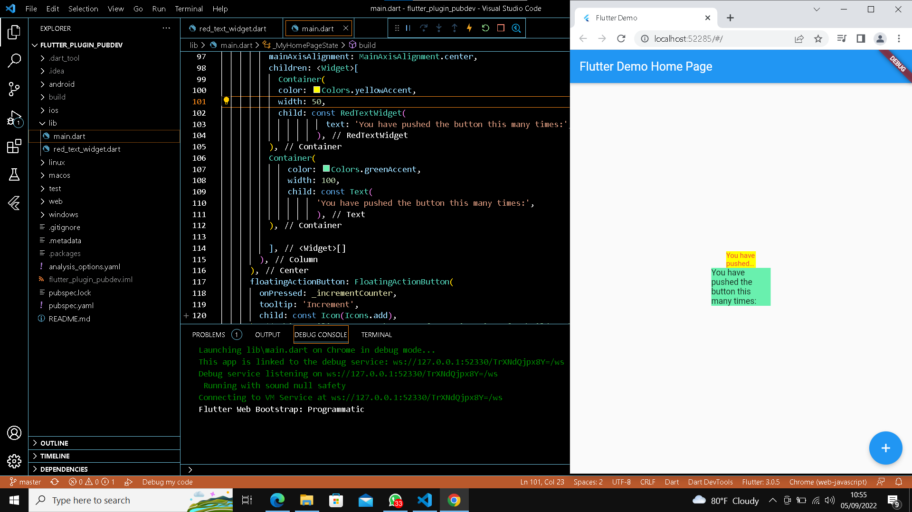
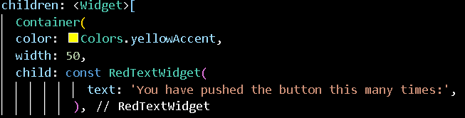
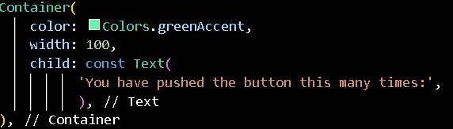
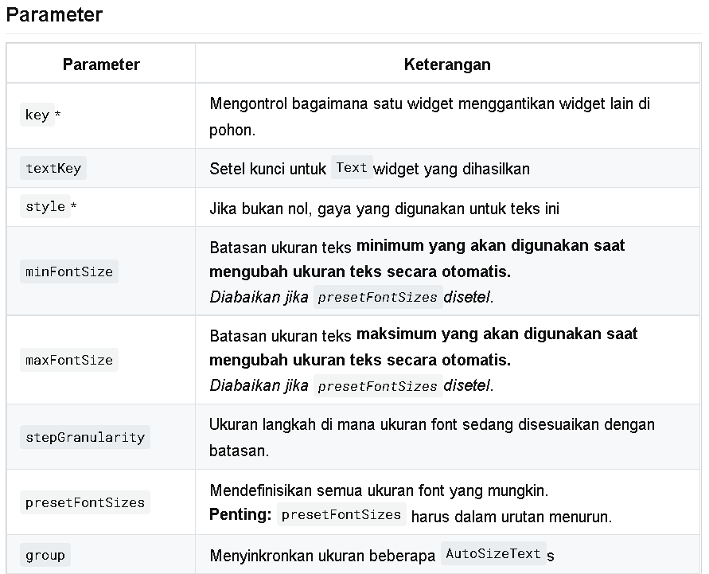
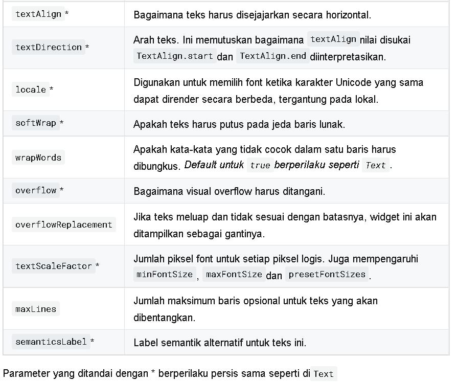

# flutter_plugin_pubdev

A new Flutter project.

# AutoSizeText
Tampilan :

auto size text berfugsi mengubah ukuran text secara otomatis yang berada didalam batasnya. Pada gambar ini terdapat perbedaan yaitu, text berwarna kuning menggunakan fungsi maxlines=2 yang berati hanya dapat menggunakan 2 baris saja dan pada text hijau tidak menggunakan fungsi tersebut (menampilkan text keseluruhan tanpa ada batas)

# Nomor 2
flutter pub add auto_size_text digunakan untuk menambahkan package ke dalam project

# Nomor 3
Penambahan variable dan parameter bertujuan untuk menginisialisasi 

# Nomor 4

Pada bagian ini menggunakan pemanggilan fungsi RedTextWidget, dimana pada fungsi tersebut dapat membatasi penggunaan lines

aaaaa

# Nomor 5

